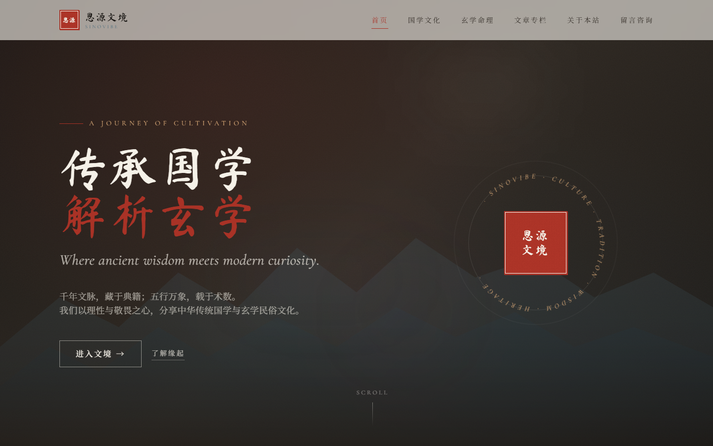
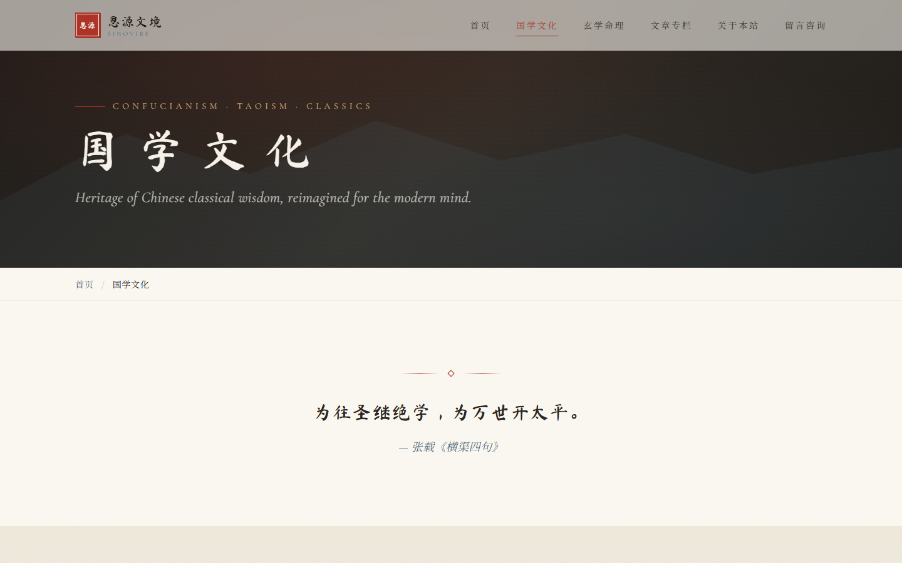
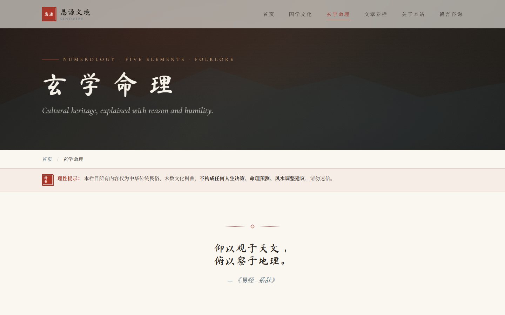
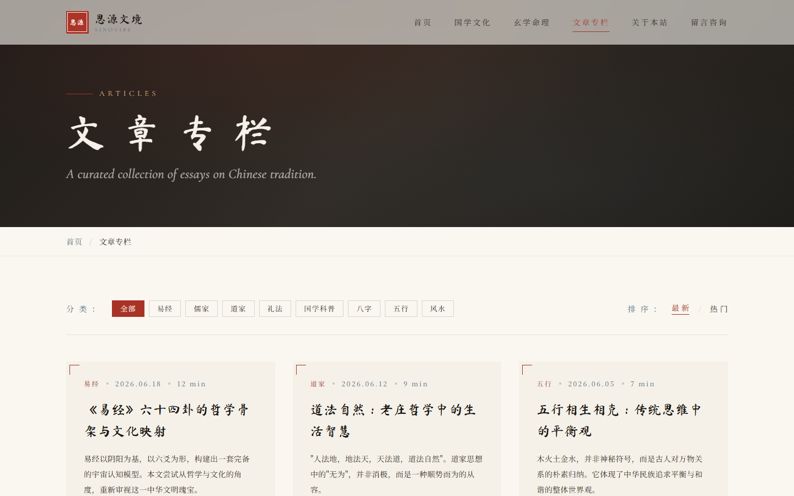
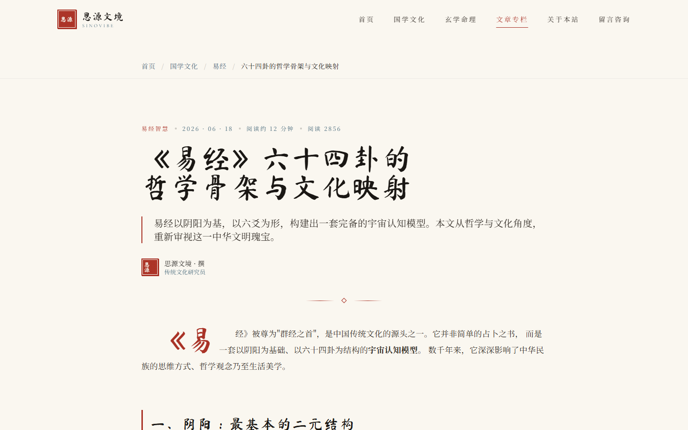
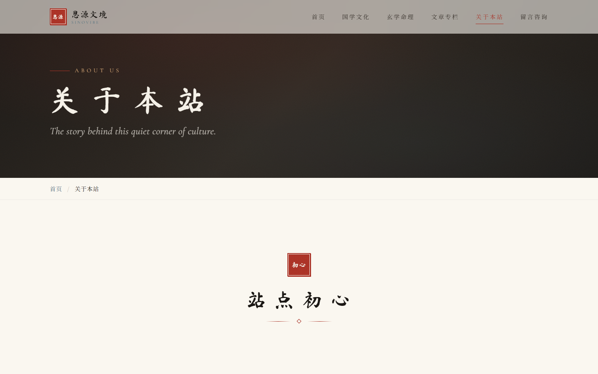
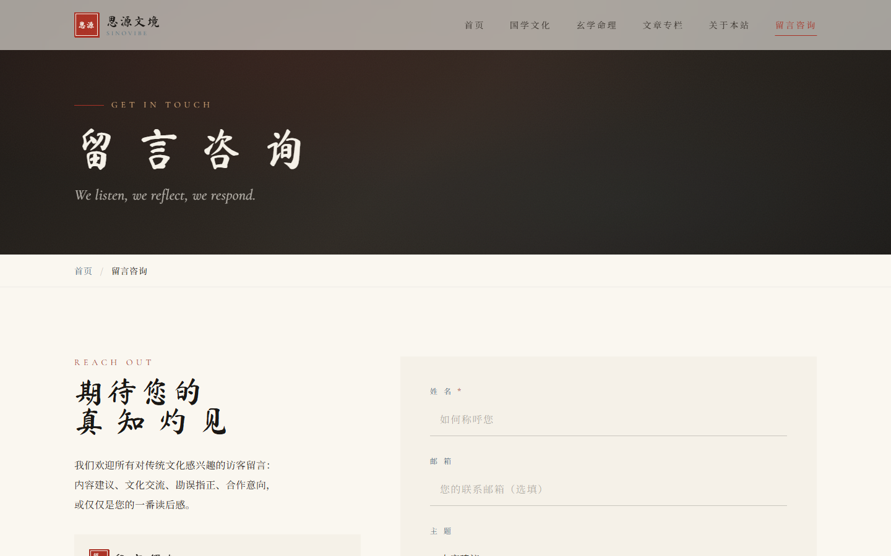
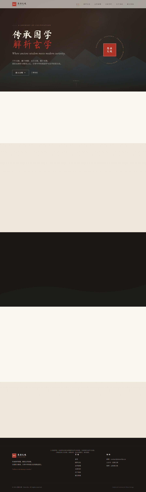
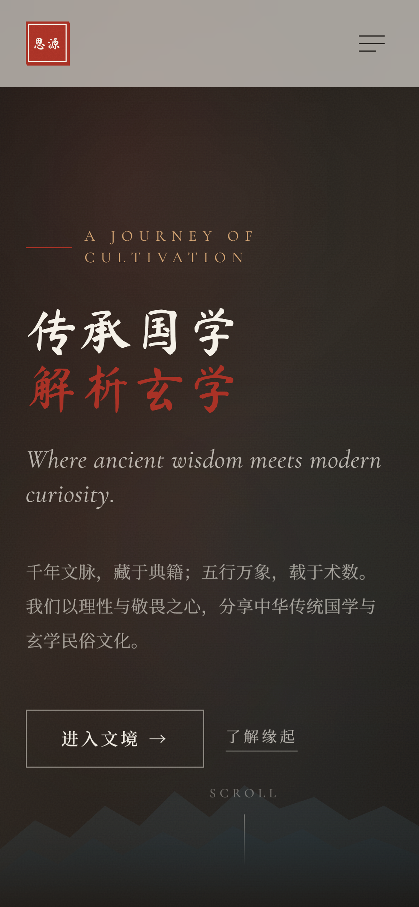

# 思源文境 · Sinovibe

> 传承国学智慧，解析玄学命理 —— 一个以理性与敬畏之心分享中华传统文化的独立站。

## 页面预览

### 桌面端（1440 × 900）

| 首页 | 国学文化 |
| :---: | :---: |
|  |  |
| **玄学命理** | **文章专栏** |
|  |  |
| **文章详情** | **关于本站** |
|  |  |
| **留言咨询** | **首页全页** |
|  |  |

### 移动端（iPhone 14）

| 首页（移动端） |
| :---: |
|  |

## 一、项目简介

思源文境是一个面向国学经典、玄学民俗、传统术数文化科普的独立静态站。
整体采用新中式国风 + 水墨极简设计，**纯静态、零后端**，可一键部署至任意静态托管服务。

- 主色调：墨黑 / 朱砂红 / 青石青 / 米白
- 辅助色：浅黄 / 黛蓝
- 中文显示字体：思源宋体（Noto Serif SC）
- 中文展示字体：马善政 / 站酷小薇
- 英文显示字体：Cormorant Garamond（斜体呈现）
- 技术栈：**HTML5 + Tailwind CSS 3 + 原生 JavaScript**

## 二、文件结构

```
Sinovibe/
├── index.html              # 首页
├── guoxue.html             # 国学文化
├── xuanxue.html            # 玄学命理
├── articles.html           # 文章专栏（聚合 + 筛选 + 排序 + 分页）
├── article-detail.html     # 文章详情（阅读模板）
├── about.html              # 关于本站
├── contact.html            # 留言咨询
├── README.md               # 部署与定制说明
└── assets/
    ├── css/
    │   └── style.css       # 自定义样式（古风装饰、水墨纹理、动效）
    └── js/
        └── main.js         # 交互脚本（导航、滚动、懒加载、筛选、表单）
```

## 三、本地预览

直接用浏览器打开 `index.html` 即可预览。
若想模拟真实部署效果（推荐），可在项目根目录起一个简易 HTTP 服务：

```bash
# Python 3
python -m http.server 8080

# Node.js (npx)
npx serve .

# 然后访问
http://localhost:8080
```

## 四、部署到静态托管

项目无后端、无构建步骤，可直接上传到以下任意平台：

### 4.1 GitHub Pages
1. 把代码推送到 GitHub 仓库；
2. `Settings → Pages → Source` 选择 `main` 分支根目录；
3. 等待几分钟后访问 `https://<your-name>.github.io/<repo>`。

### 4.2 Vercel / Netlify
- 直接拖拽项目文件夹到 Vercel/Netlify 控制台，或连接 Git 仓库自动部署。

### 4.3 Nginx 自有服务器
将整个项目上传至服务器，nginx 配置示例：

```nginx
server {
    listen 80;
    server_name sinovibe.cn www.sinovibe.cn;
    root /var/www/sinovibe;
    index index.html;

    location / {
        try_files $uri $uri/ /index.html;
    }
}
```

### 4.4 阿里云 OSS / 腾讯云 COS
开启静态网站托管，将 `index.html` 设为默认首页即可。

## 五、域名绑定

1. 购买并备案域名（国内服务器需备案）；
2. 在 DNS 服务商处将域名 CNAME / A 记录指向托管平台提供的地址；
3. 在托管平台绑定自定义域名；
4. 强烈建议同时开启 HTTPS（Let's Encrypt / 云厂商免费证书均可）。

## 六、如何自定义内容

### 6.1 替换站点名称 / Slogan
全局搜索 `思源文境` 替换为你的站点名；全局搜索 `传承国学智慧，解析玄学命理` 替换为你的 Slogan。

### 6.2 替换 Logo
Logo 是 HTML 中的印章元素：
```html
<span class="seal seal-sm">思源</span>
```
修改中间的两个字即可。如需图形 logo，可替换为：
```html

```

### 6.3 替换文章内容
打开 `article-detail.html`，找到 `<div class="prose-classic">` 区块，
按以下结构新增 / 替换你的文章：

```html
<h2>小节标题</h2>
<p>段落内容（自动首行缩进 2 字）</p>
<blockquote>引言 / 古文引用</blockquote>
<ul><li>列表项</li></ul>
```

为每篇文章复制一份 `article-detail.html`，并修改：
- `<title>` 与 `meta description`
- 顶部标题、分类、日期
- 面包屑分类链接
- 正文内容

然后在 `articles.html` 的卡片网格中：
```html
<a href="article-detail.html" class="article-card"
   data-category="yi"        <!-- 与筛选按钮的 data-filter 一致 -->
   data-date="2026-06-18"    <!-- 用于排序 -->
   data-views="2856">         <!-- 用于热度 -->
```

### 6.4 接入真实留言后端
当前 `contact.html` 的表单是**前端模拟**提交。
如需真实接收留言，可对接：
- **Formspree**（推荐）：`<form action="https://formspree.io/f/YOUR_ID" method="POST">`
- **腾讯云函数 / Cloudflare Workers**：自己写接收 API
- **第三方表单服务**：Tally、Wufoo 等

修改 `contact.html` 中的 `<form>` 标签即可，JS 逻辑保留用于前端校验。

### 6.5 修改联系方式
在每个页面的 Footer 区域搜索 `contact@sinovibe.cn` 替换为你的邮箱；
搜索 `思源文境` 修改公众号、微博名。

### 6.6 修改主色调
打开 `assets/css/style.css`，修改 `:root` 变量即可全站生效：
```css
--cinnabar: #a93226;   /* 朱砂红 */
--stone-blue: #4a6b7c; /* 青石青 */
--rice-white: #f5f1e8; /* 米白 */
```

### 6.7 接入图片
将图片放在 `assets/images/` 下，使用：
```html

```
`data-src` 会被自动懒加载；同时请为每张图填写**有意义的 alt 文本**（利于 SEO）。

## 七、SEO 说明

- 每个页面均已配置 `<title>` / `description` / `keywords`；
- 使用语义化标签（`<header>` / `<nav>` / `<main>` / `<article>` / `<footer>`）；
- 文章 h1-h6 层级规范；
- 移动端 viewport 完整；
- 友情链接、外链建设建议另起 SEO 计划。

提交搜索引擎收录：
- Google Search Console：https://search.google.com/search-console
- 百度搜索资源平台：https://ziyuan.baidu.com

## 八、合规要点（务必保留）

本站所有内容为**中华传统国学、玄学民俗、术数文化科普**，
**不构成**任何人生决策、命理预测、风水调整、择日建议。

每页底部均带有固定免责声明，**请勿删除**。
任何改造、二次发布时，请保留：

> 本站所有内容为传统国学玄学文化科普，仅供传统文化学习交流，
> 不构成任何人生决策、命理决策、风水决策建议，请勿迷信。

## 九、浏览器兼容

- Chrome / Edge / Firefox / Safari 最近 2 年版本
- iOS Safari 14+
- Android Chrome 90+
- 不支持 IE（已停止维护）

## 十、致谢

愿每一位读者，都能在传统文化中找到属于自己的一份宁静。

— 思源文境 · Sinovibe
